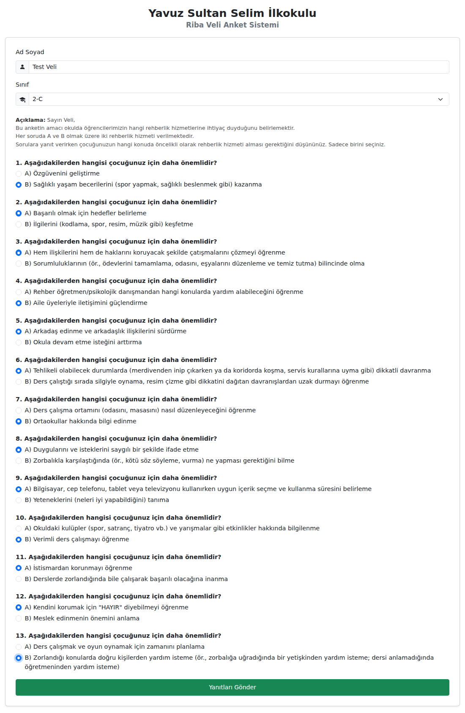
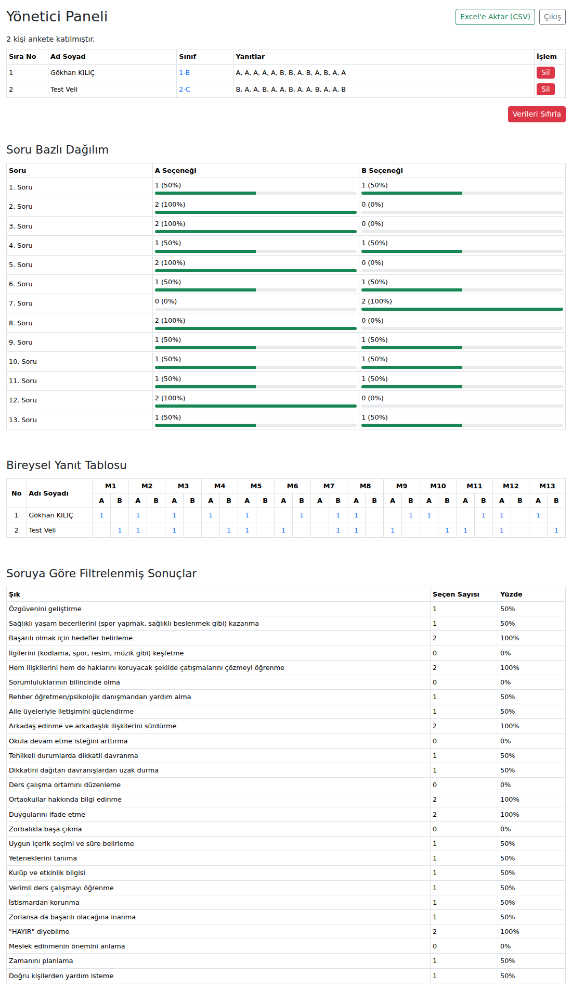

# Riba Veli Anket Sistemi

Yavuz Sultan Selim İlkokulu için iki seçenekli (A/B) veli anketi ve sonuçları gösteren yönetici paneli.

## Kurulum ve Çalıştırma

Yalnızca [Node.js](https://nodejs.org) (18 veya üzeri) gerekir, ek paket kurulumu yoktur.

```bash
node server.js
```

- Veli anket sayfası: http://localhost:3000
- Yönetici paneli: http://localhost:3000/admin  (varsayılan şifre: `admin123`)

Şifreyi ve portu değiştirmek için:

```bash
ADMIN_PASSWORD=gizliSifre PORT=8080 node server.js
```

> Yayına almadan önce mutlaka `ADMIN_PASSWORD` belirleyin.

## Özellikler

**Veli sayfası**
- Ad Soyad ve Sınıf seçimi
- 13 adet A/B sorusu; eksik bırakılan sorular kırmızı ile işaretlenir
- Gönderimden sonra teşekkür mesajı

**Yönetici paneli**
- Katılımcı listesi (Sıra No, Ad Soyad, Sınıf, Yanıtlar) ve kayıt silme
- Tüm verileri sıfırlama
- **Soru Bazlı Dağılım**: her soru için A ve B seçeneğinin sayısı ve yüzdesi
- **Bireysel Yanıt Tablosu**: M1–M13 sütunlarında her velinin seçimi
- **Soruya Göre Filtrelenmiş Sonuçlar**: her şıkkın seçilme sayısı ve yüzdesi
- Sonuçları Excel'de açılabilen CSV olarak indirme

## Soruları / Sınıfları Düzenleme

Okul adı, sorular, şıklar ve sınıf listesi `questions.js` dosyasındadır.
Soru sırası değiştirilirse mevcut yanıtlar yanlış soruya eşleşir; bu durumda önce panelden verileri sıfırlayın.

## Veriler

Yanıtlar `data/db.json` dosyasında saklanır (git'e eklenmez). Yedek almak için bu dosyayı kopyalamanız yeterlidir.

## Ekran Görüntüleri

| Veli Anketi | Yönetici Paneli |
|---|---|
|  |  |
