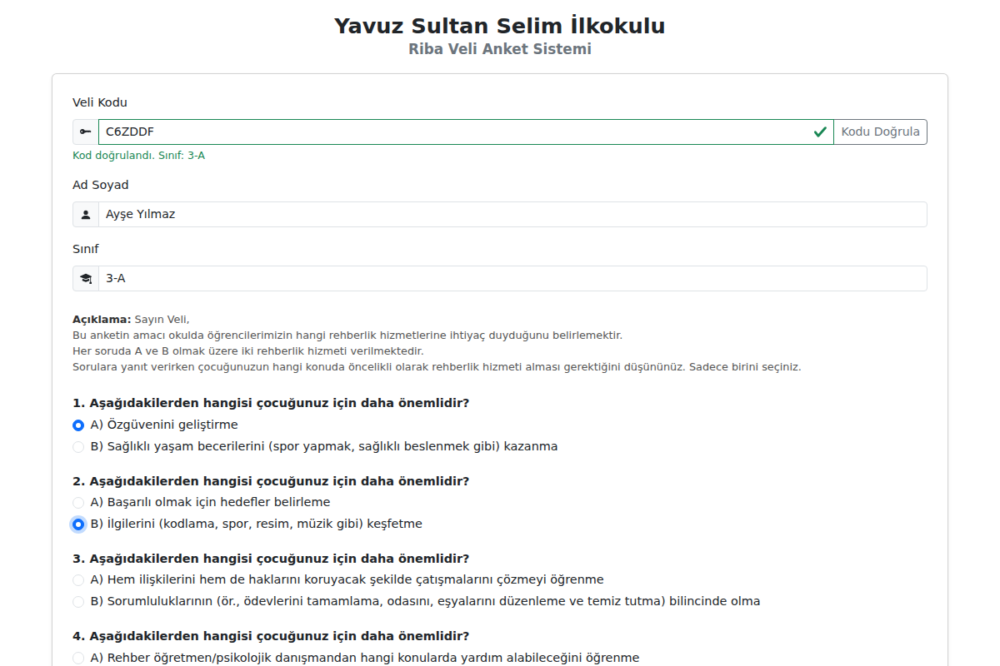
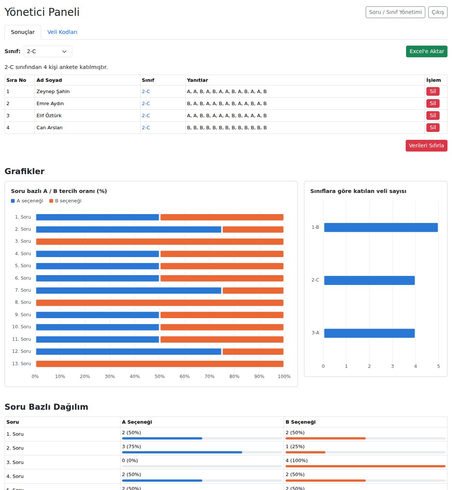
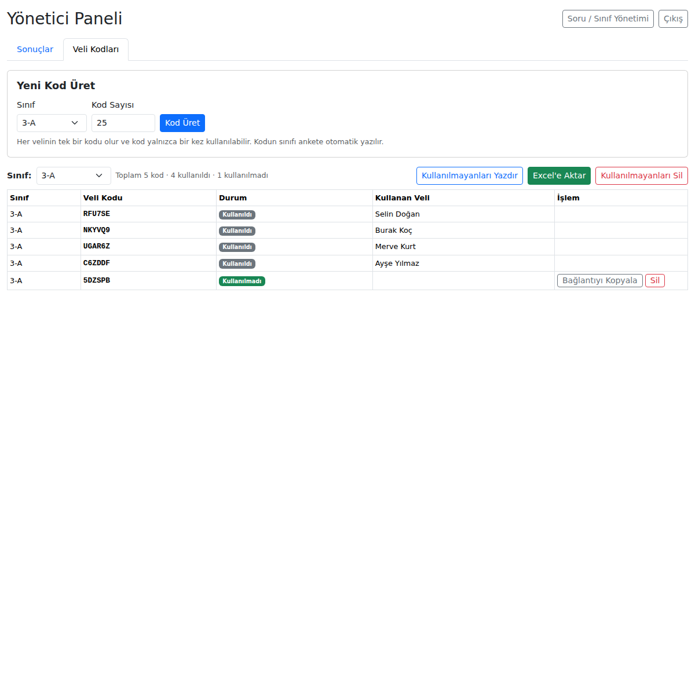
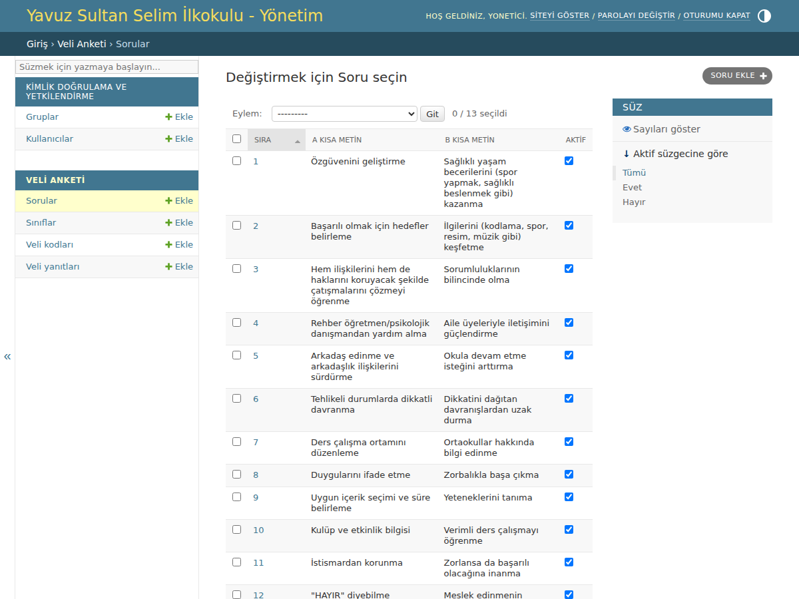

# Riba Veli Anket Sistemi — Python / Django sürümü

Node.js sürümüyle aynı özellikleri sunar. Ek olarak Django'nun hazır **yönetim paneli (admin)** sayesinde sorular, sınıflar, kodlar ve yanıtlar kod yazmadan tarayıcıdan düzenlenebilir.

## Özellikler

- **Tek kullanımlık veli kodları.** Kod doğrulanınca sınıf otomatik gelir. Kod bağlantıyla da gelebilir: `/?kod=AB12CD`.
- **Veli formu.** 13 A/B sorusu vardır. Eksik bırakılan sorular kırmızı ile işaretlenir ve hata olursa verilen cevaplar korunur.
- **Yönetici paneli (`/panel/`):**
  - Sınıf filtresi
  - Grafikler (Chart.js)
  - Katılımcı listesi, soru bazlı dağılım, bireysel yanıt tablosu, şık bazlı sonuçlar ve sınıf özeti
  - 5 sayfalık **Excel (.xlsx)** raporu
  - Tek bir yanıtı silme (velinin kodu serbest kalır) ve tüm verileri sıfırlama
- **Veli kodları (`/panel/kodlar/`):** kod üretme, kesilip dağıtılacak kartlar halinde yazdırma, Excel'e aktarma, bağlantı kopyalama ve kullanılmayan kodları silme.
- **Django admin (`/admin/`):**
  - Soru metinlerini düzenleme, yeni soru ekleme, soruyu pasif yapma
  - Sınıf ekleme ve sıralama
  - Yanıtları ve kodları arama

| Veli formu | Sonuçlar (sınıf filtresi + grafikler) |
|---|---|
|  |  |

| Veli kodları | Django admin (soru yönetimi) |
|---|---|
|  |  |

## Kurulum (yerel)

Python 3.10 veya üzeri gerekir.

```bash
cd django-app
python -m venv .venv
source .venv/bin/activate          # Windows: .venv\Scripts\activate
pip install -r requirements.txt
python manage.py migrate           # tabloları, 13 soruyu ve sınıfları oluşturur
python manage.py createsuperuser   # yönetici kullanıcısı
python manage.py runserver
```

- Veli anketi: http://127.0.0.1:8000/
- Yönetici paneli: http://127.0.0.1:8000/panel/ (giriş için `createsuperuser` ile oluşturduğunuz kullanıcıyı kullanın)
- Django admin: http://127.0.0.1:8000/admin/

Birden fazla öğretmen panele girecekse **Django admin → Kullanıcılar** bölümünden her birine ayrı kullanıcı açın ve "Personel durumu" kutusunu işaretleyin.

## Veritabanı seçimi

| Durum | Ayar |
|---|---|
| Kendi sunucunuz / bilgisayarınız | Hiçbir şey yapmayın. `db.sqlite3` (SQLite) kullanılır. |
| Ücretsiz barındırma (Render vb.) | `DATABASE_URL` ile **Supabase** (PostgreSQL) bağlantısı verin. |

**Supabase bağlantısı:**
1. Supabase'de ücretsiz bir proje oluşturun.
2. **Project Settings → Database → Connection string** bölümünden **Session pooler** adresini alın.
3. Bu adresi `DATABASE_URL` olarak girip `python manage.py migrate` çalıştırın.

## Yayına alma (örnek: Render.com + Supabase)

- **Root Directory:** `django-app`
- **Build Command:** `pip install -r requirements.txt && python manage.py collectstatic --noinput && python manage.py migrate`
- **Start Command:** `gunicorn config.wsgi`
- **Environment:** `.env.example` dosyasındaki değişkenler

| Değişken | Açıklama |
|---|---|
| `DEBUG` | Yayında `0` olmalı |
| `SECRET_KEY` | Uzun, rastgele bir metin. `DEBUG=0` iken zorunludur. |
| `ALLOWED_HOSTS` | Sitenin alan adı (virgülle birden fazla) |
| `CSRF_TRUSTED_ORIGINS` | `https://` ile başlayan site adresi |
| `DATABASE_URL` | Supabase / PostgreSQL bağlantı adresi |
| `ANKET_OKUL_ADI`, `ANKET_ADI` | İsteğe bağlı: başlıkta görünen okul ve anket adı |

Yönetici kullanıcısını sunucuda bir kez oluşturun: `python manage.py createsuperuser`.
Render'da bu komutu "Shell" sekmesinden çalıştırabilirsiniz.

## Testler

```bash
python manage.py test anket                                               # SQLite
DATABASE_URL=postgres://postgres@localhost/anket python manage.py test anket  # PostgreSQL
```

PostgreSQL'de ek olarak **aynı koda eşzamanlı gönderim** testi çalışır. Bu test, bir kodun gerçekten tek kez kullanılabildiğini doğrular.

## Proje yapısı

```
django-app/
├── config/            # Django ayarları ve URL'ler
├── anket/
│   ├── models.py      # Sinif, Soru, VeliKodu, VeliYaniti, Cevap
│   ├── views.py       # veli formu, panel, kodlar, Excel
│   ├── istatistik.py  # sayı / yüzde hesapları
│   ├── excel.py       # openpyxl ile .xlsx raporları
│   ├── admin.py       # Django admin ayarları
│   ├── baslangic.py   # ilk kurulumdaki 13 soru ve sınıf listesi
│   ├── templates/     # HTML şablonları
│   └── static/        # CSS, JS, Bootstrap, Chart.js
└── requirements.txt
```
